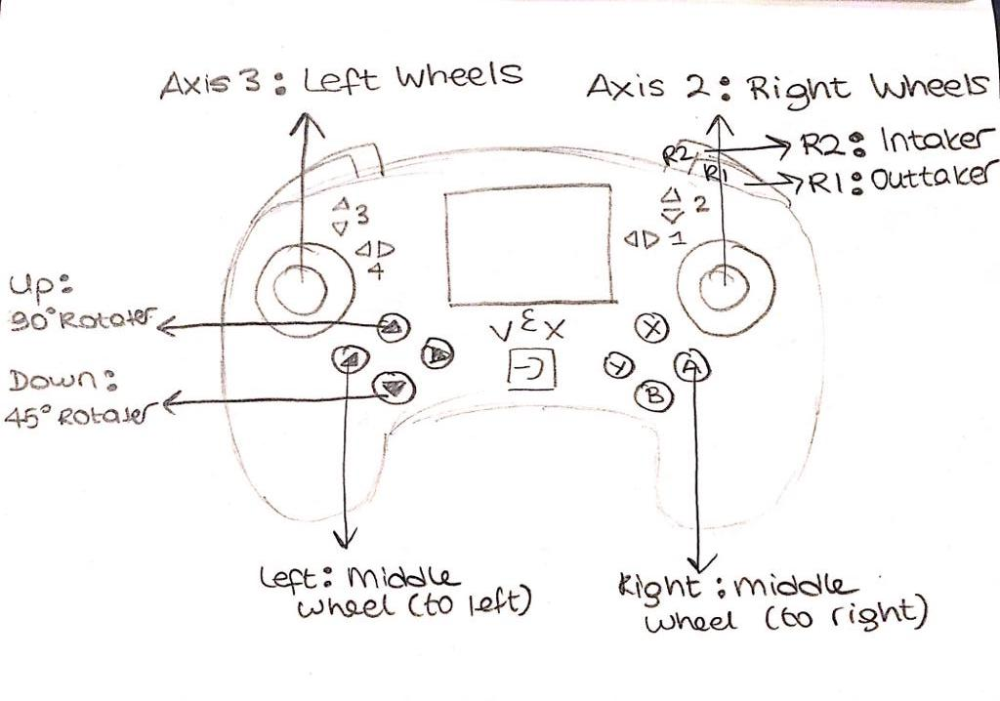
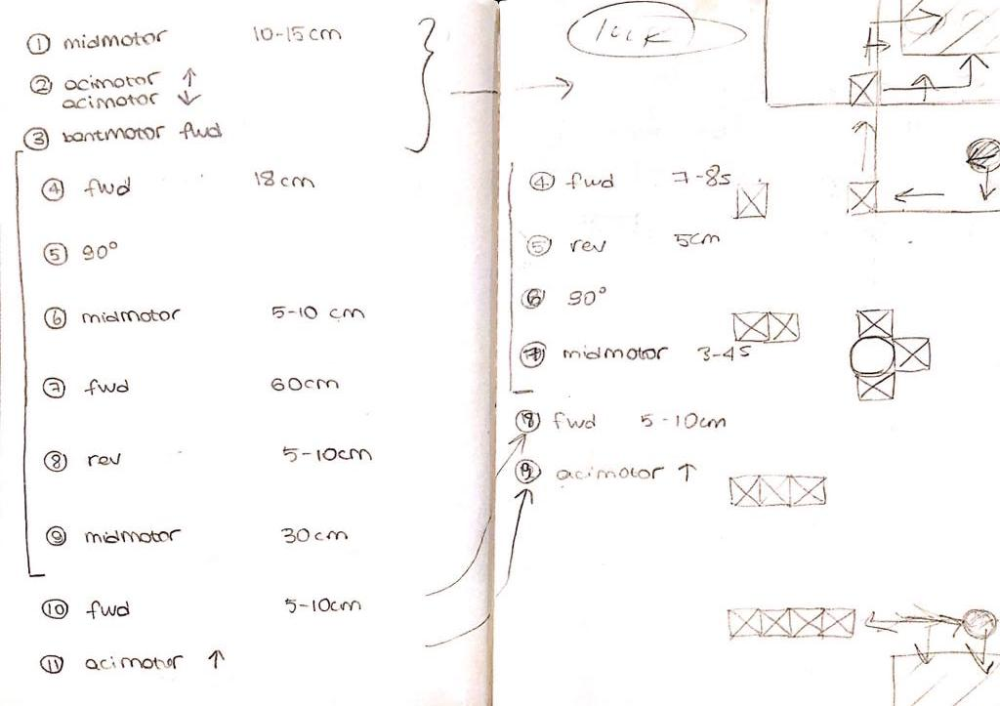

# Hepta

### Hepta Nedir?

Hedpta, VEX Robotics Competition 2019-2020 Tower Takeover temalı robotik yarışması için 7 lise öğrencisinden oluşan bir takım tarafından dizayn edilmiş, inşaa edilmiş, programlanmış bir VEX V5 robotudur. 

### Hepta'nın Özellikleri:

V5 kitinin içerisindeki parçalar kullanılarak VEX Robotics Competition 2019-2020 Tower Takeover temalı robotik yarışmasında kullanılan küplerden 4-5 adet taşıyabilen, depolayabilen ve bu küpleri yerlerine yerleştirebilen bir robottur. Her iki ittifak grubu için 2 farklı otonom seçeneği bulunmaktadır. 

### Hepta'nın Kontrolü:

### Hepta'nın Otonomu:
Kodun dilinden çok algoritmanın önemli olduğunu bildiğimizden otonomu programlamaya planlama ile başladık. Bu planlamada algoritmanın adım adım nasıl bir yol izleyeceğini sahayı ve robotun teknik yapısını ele alarak belirledik. Sahanın içinde robotun izleyeceği yolun uzunluğunun yanı sıra robotun tekerleğinin çevresinin değerlerini kullanarak gerekli hesaplamalarımızı yaptık. İki farklı ittifak için ikişer tane olmak üzere dört farklı otonom kodu hazırladık. Beyinin sekiz farklı kodu hafızasında barındırması özelliğini göz önünde bulundurarak bu dört farklı otonom kodumuzu dört farklı yarışma kodu olarak beyine aktardık. 

